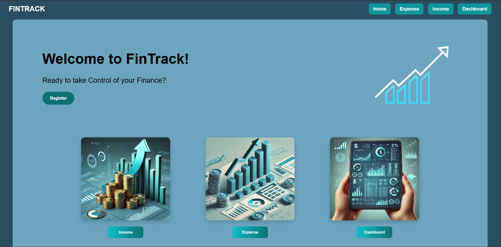
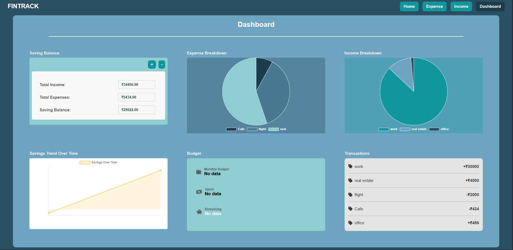

# 💰 Fintrack – Personal Finance Tracker

Fintrack is a full-stack personal finance tracking application built using Spring Boot.  
It allows users to manage their income and expenses, view transaction history, and monitor their financial health through a simple dashboard.

🚀 The project is now fully deployed on cloud and enhanced with:

- 🔐 Spring Security + JWT Authentication  
- 🐳 Docker & Docker Compose

---
## 💡 Why This Project?

Fintrack was built to provide a simple and efficient way to track personal income, expenses and provides visual insights of user's data using charts.  
It also showcases my ability to design secure and scalable backend systems using Spring Boot, 
implement JWT-based authentication, and containerize applications with Docker.

---

## 🌐 Live Demo

🔗 https://fintrack-bh2n.onrender.com

---

## 🚀 Features

- 🔐 Secure User Authentication (JWT-based)  
- ➕ Add income with backend validation  
- ➖ Add expenses with backend validation  
- 📊 View transaction history (income + expenses)  
- 📈 Dashboard summary for financial tracking with visual insights(Pie and Line charts)  
- 👤 User-specific data isolation  
- 🧩 Clean layered architecture (Controller → Service → Repository)

---

## 🛠️ Tech Stack

### Backend
- **Java 17**
- **Spring Boot**
- **Spring Security**
- **JWT (JSON Web Tokens)**
- **Spring Data JPA (Hibernate)**

### Database
- **MySQL**

### Frontend
- **HTML, CSS, JavaScript**

### DevOps & Deployment
- **Docker**
- **Docker Compose**
- **AWS (Elastic Beanstalk)**

---
## 📸 Screenshots
### HomePage


### Login


### Dashboard


---

## 🏗️ Project Structure

Fintrack

├── controller

├── service

├── repository

├── entity

├── security

├── config

└── resources

---

## 🔐 Authentication Flow

1. User registers  
2. User logs in → receives JWT token  
3. Token is sent in Authorization header  
4. Backend validates token via JWT filter  
5. Access granted to protected APIs

---

## ⚙️ How to Run Locally

1. Clone the repository
```bash
git clone https://github.com/<your-username>/Fintrack.git

```
2. Configure MySQL database in application.properties

3. Run the application
```bash
mvn spring-boot:run
```
4. Open in browser
```bash
http://localhost:8080/
```

---

## 🐳 Running with Docker

Run the application using Docker Compose:
```bash
docker-compose up --build
```

---

## ☁️ Deployment

The application is deployed on Render.

---

## 🎯 Why This Project

Fintrack is designed to demonstrate:

Strong Spring Boot fundamentals

Secure authentication using JWT

Proper backend validation and error handling

Clean code and layered design

Hands-on cloud deployment

---

## 📌 Project Status

✅ Deployed & Actively Maintained.

---

## 🤝 Contributions

This is a personal learning project.
Suggestions and improvements are welcome.

## ⭐ If you find this project helpful or interesting, feel free to star the repository!
